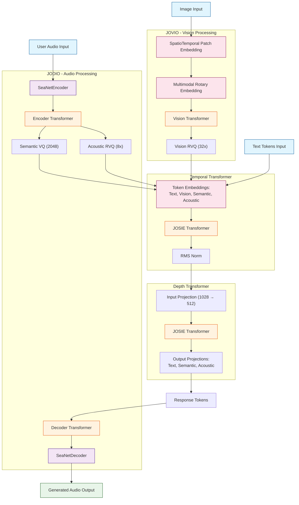

# Architecture

```txt
JOSIE(
  (jodio): JODIO(
    (encoder): SeaNetEncoder(
      (input_proj): ParametrizedConv1d(
        1, 512, kernel_size=(3,), stride=(1,), padding=(1,)
        (parametrizations): ModuleDict(
          (weight): ParametrizationList(
            (0): _WeightNorm()
          )
        )
      )
      (conv_blocks): ModuleList(
        (0): ConvBlock(
          (layers): ModuleList(
            (0): Sequential(
              (0): ConstantPad1d(padding=(1, 1), value=0)
              (1): ParametrizedConv1d(
                512, 512, kernel_size=(3,), stride=(1,)
                (parametrizations): ModuleDict(
                  (weight): ParametrizationList(
                    (0): _WeightNorm()
                  )
                )
              )
              (2): SiLU()
            )
            (1): Sequential(
              (0): ConstantPad1d(padding=(2, 2), value=0)
              (1): ParametrizedConv1d(
                512, 512, kernel_size=(3,), stride=(1,), dilation=(2,)
                (parametrizations): ModuleDict(
                  (weight): ParametrizationList(
                    (0): _WeightNorm()
                  )
                )
              )
              (2): SiLU()
            )
            (2): Sequential(
              (0): ConstantPad1d(padding=(4, 4), value=0)
              (1): ParametrizedConv1d(
                512, 512, kernel_size=(3,), stride=(1,), dilation=(4,)
                (parametrizations): ModuleDict(
                  (weight): ParametrizationList(
                    (0): _WeightNorm()
                  )
                )
              )
              (2): SiLU()
            )
          )
          (downsample): Sequential(
            (0): ConstantPad1d(padding=(1, 1), value=0)
            (1): ParametrizedConv1d(
              512, 512, kernel_size=(3,), stride=(4,)
              (parametrizations): ModuleDict(
                (weight): ParametrizationList(
                  (0): _WeightNorm()
                )
              )
            )
          )
        )
        (1): ConvBlock(
          (layers): ModuleList(
            (0): Sequential(
              (0): ConstantPad1d(padding=(1, 1), value=0)
              (1): ParametrizedConv1d(
                512, 512, kernel_size=(3,), stride=(1,)
                (parametrizations): ModuleDict(
                  (weight): ParametrizationList(
                    (0): _WeightNorm()
                  )
                )
              )
              (2): SiLU()
            )
            (1): Sequential(
              (0): ConstantPad1d(padding=(2, 2), value=0)
              (1): ParametrizedConv1d(
                512, 512, kernel_size=(3,), stride=(1,), dilation=(2,)
                (parametrizations): ModuleDict(
                  (weight): ParametrizationList(
                    (0): _WeightNorm()
                  )
                )
              )
              (2): SiLU()
            )
            (2): Sequential(
              (0): ConstantPad1d(padding=(4, 4), value=0)
              (1): ParametrizedConv1d(
                512, 512, kernel_size=(3,), stride=(1,), dilation=(4,)
                (parametrizations): ModuleDict(
                  (weight): ParametrizationList(
                    (0): _WeightNorm()
                  )
                )
              )
              (2): SiLU()
            )
          )
          (downsample): Sequential(
            (0): ConstantPad1d(padding=(1, 1), value=0)
            (1): ParametrizedConv1d(
              512, 512, kernel_size=(3,), stride=(5,)
              (parametrizations): ModuleDict(
                (weight): ParametrizationList(
                  (0): _WeightNorm()
                )
              )
            )
          )
        )
        (2): ConvBlock(
          (layers): ModuleList(
            (0): Sequential(
              (0): ConstantPad1d(padding=(1, 1), value=0)
              (1): ParametrizedConv1d(
                512, 512, kernel_size=(3,), stride=(1,)
                (parametrizations): ModuleDict(
                  (weight): ParametrizationList(
                    (0): _WeightNorm()
                  )
                )
              )
              (2): SiLU()
            )
            (1): Sequential(
              (0): ConstantPad1d(padding=(2, 2), value=0)
              (1): ParametrizedConv1d(
                512, 512, kernel_size=(3,), stride=(1,), dilation=(2,)
                (parametrizations): ModuleDict(
                  (weight): ParametrizationList(
                    (0): _WeightNorm()
                  )
                )
              )
              (2): SiLU()
            )
            (2): Sequential(
              (0): ConstantPad1d(padding=(4, 4), value=0)
              (1): ParametrizedConv1d(
                512, 512, kernel_size=(3,), stride=(1,), dilation=(4,)
                (parametrizations): ModuleDict(
                  (weight): ParametrizationList(
                    (0): _WeightNorm()
                  )
                )
              )
              (2): SiLU()
            )
          )
          (downsample): Sequential(
            (0): ConstantPad1d(padding=(1, 1), value=0)
            (1): ParametrizedConv1d(
              512, 512, kernel_size=(3,), stride=(6,)
              (parametrizations): ModuleDict(
                (weight): ParametrizationList(
                  (0): _WeightNorm()
                )
              )
            )
          )
        )
        (3): ConvBlock(
          (layers): ModuleList(
            (0): Sequential(
              (0): ConstantPad1d(padding=(1, 1), value=0)
              (1): ParametrizedConv1d(
                512, 512, kernel_size=(3,), stride=(1,)
                (parametrizations): ModuleDict(
                  (weight): ParametrizationList(
                    (0): _WeightNorm()
                  )
                )
              )
              (2): SiLU()
            )
            (1): Sequential(
              (0): ConstantPad1d(padding=(2, 2), value=0)
              (1): ParametrizedConv1d(
                512, 512, kernel_size=(3,), stride=(1,), dilation=(2,)
                (parametrizations): ModuleDict(
                  (weight): ParametrizationList(
                    (0): _WeightNorm()
                  )
                )
              )
              (2): SiLU()
            )
            (2): Sequential(
              (0): ConstantPad1d(padding=(4, 4), value=0)
              (1): ParametrizedConv1d(
                512, 512, kernel_size=(3,), stride=(1,), dilation=(4,)
                (parametrizations): ModuleDict(
                  (weight): ParametrizationList(
                    (0): _WeightNorm()
                  )
                )
              )
              (2): SiLU()
            )
          )
          (downsample): Sequential(
            (0): ConstantPad1d(padding=(1, 1), value=0)
            (1): ParametrizedConv1d(
              512, 512, kernel_size=(3,), stride=(8,)
              (parametrizations): ModuleDict(
                (weight): ParametrizationList(
                  (0): _WeightNorm()
                )
              )
            )
          )
        )
      )
      (final_conv): ParametrizedConv1d(
        512, 512, kernel_size=(3,), stride=(2,), padding=(2,)
        (parametrizations): ModuleDict(
          (weight): ParametrizationList(
            (0): _WeightNorm()
          )
        )
      )
    )
    (encoder_transformer): Transformer(
      (layers): ModuleList(
        (0-11): 12 x TransformerBlock(
          (attention): Attention(
            (q_proj): Linear(in_features=512, out_features=512, bias=False)
            (k_proj): Linear(in_features=512, out_features=512, bias=False)
            (v_proj): Linear(in_features=512, out_features=512, bias=False)
            (out_proj): Linear(in_features=512, out_features=512, bias=False)
            (dropout): Dropout(p=0.1, inplace=False)
          )
          (feed_forward): MultiLayerPerception(
            (linear1): Linear(in_features=512, out_features=2048, bias=False)
            (linear2): Linear(in_features=2048, out_features=512, bias=False)
            (dropout): Dropout(p=0.1, inplace=False)
          )
          (attention_norm): RMSNorm()
          (mlp_norm): RMSNorm()
        )
      )
      (norm): RMSNorm()
    )
    (semantic_rvq): VectorQuantizer(
      (codebook): Embedding(2048, 512)
    )
    (acoustic_rvq): ResidualVectorQuantizer(
      (quantizers): ModuleList(
        (0-7): 8 x VectorQuantizer(
          (codebook): Embedding(2048, 512)
        )
      )
    )
    (decoder_transformer): Transformer(
      (layers): ModuleList(
        (0-11): 12 x TransformerBlock(
          (attention): Attention(
            (q_proj): Linear(in_features=512, out_features=504, bias=False)
            (k_proj): Linear(in_features=512, out_features=504, bias=False)
            (v_proj): Linear(in_features=512, out_features=504, bias=False)
            (out_proj): Linear(in_features=504, out_features=512, bias=False)
            (dropout): Dropout(p=0.1, inplace=False)
          )
          (feed_forward): MultiLayerPerception(
            (linear1): Linear(in_features=512, out_features=2048, bias=False)
            (linear2): Linear(in_features=2048, out_features=512, bias=False)
            (dropout): Dropout(p=0.1, inplace=False)
          )
          (attention_norm): RMSNorm()
          (mlp_norm): RMSNorm()
        )
      )
      (norm): RMSNorm()
    )
    (decoder): SeaNetDecoder(
      (initial_upsample): ParametrizedConvTranspose1d(
        512, 512, kernel_size=(4,), stride=(2,), padding=(1,)
        (parametrizations): ModuleDict(
          (weight): ParametrizationList(
            (0): _WeightNorm()
          )
        )
      )
      (conv_blocks): ModuleList(
        (0): TransposedConvBlock(
          (upsample): ParametrizedConvTranspose1d(
            512, 512, kernel_size=(3,), stride=(8,), padding=(1,), output_padding=(7,)
            (parametrizations): ModuleDict(
              (weight): ParametrizationList(
                (0): _WeightNorm()
              )
            )
          )
          (layers): ModuleList(
            (0): Sequential(
              (0): ConstantPad1d(padding=(4, 4), value=0)
              (1): ParametrizedConv1d(
                512, 512, kernel_size=(3,), stride=(1,), dilation=(4,)
                (parametrizations): ModuleDict(
                  (weight): ParametrizationList(
                    (0): _WeightNorm()
                  )
                )
              )
              (2): SiLU()
            )
            (1): Sequential(
              (0): ConstantPad1d(padding=(2, 2), value=0)
              (1): ParametrizedConv1d(
                512, 512, kernel_size=(3,), stride=(1,), dilation=(2,)
                (parametrizations): ModuleDict(
                  (weight): ParametrizationList(
                    (0): _WeightNorm()
                  )
                )
              )
              (2): SiLU()
            )
            (2): Sequential(
              (0): ConstantPad1d(padding=(1, 1), value=0)
              (1): ParametrizedConv1d(
                512, 512, kernel_size=(3,), stride=(1,)
                (parametrizations): ModuleDict(
                  (weight): ParametrizationList(
                    (0): _WeightNorm()
                  )
                )
              )
              (2): SiLU()
            )
          )
        )
        (1): TransposedConvBlock(
          (upsample): ParametrizedConvTranspose1d(
            512, 512, kernel_size=(3,), stride=(6,), padding=(1,), output_padding=(5,)
            (parametrizations): ModuleDict(
              (weight): ParametrizationList(
                (0): _WeightNorm()
              )
            )
          )
          (layers): ModuleList(
            (0): Sequential(
              (0): ConstantPad1d(padding=(4, 4), value=0)
              (1): ParametrizedConv1d(
                512, 512, kernel_size=(3,), stride=(1,), dilation=(4,)
                (parametrizations): ModuleDict(
                  (weight): ParametrizationList(
                    (0): _WeightNorm()
                  )
                )
              )
              (2): SiLU()
            )
            (1): Sequential(
              (0): ConstantPad1d(padding=(2, 2), value=0)
              (1): ParametrizedConv1d(
                512, 512, kernel_size=(3,), stride=(1,), dilation=(2,)
                (parametrizations): ModuleDict(
                  (weight): ParametrizationList(
                    (0): _WeightNorm()
                  )
                )
              )
              (2): SiLU()
            )
            (2): Sequential(
              (0): ConstantPad1d(padding=(1, 1), value=0)
              (1): ParametrizedConv1d(
                512, 512, kernel_size=(3,), stride=(1,)
                (parametrizations): ModuleDict(
                  (weight): ParametrizationList(
                    (0): _WeightNorm()
                  )
                )
              )
              (2): SiLU()
            )
          )
        )
        (2): TransposedConvBlock(
          (upsample): ParametrizedConvTranspose1d(
            512, 512, kernel_size=(3,), stride=(5,), padding=(1,), output_padding=(4,)
            (parametrizations): ModuleDict(
              (weight): ParametrizationList(
                (0): _WeightNorm()
              )
            )
          )
          (layers): ModuleList(
            (0): Sequential(
              (0): ConstantPad1d(padding=(4, 4), value=0)
              (1): ParametrizedConv1d(
                512, 512, kernel_size=(3,), stride=(1,), dilation=(4,)
                (parametrizations): ModuleDict(
                  (weight): ParametrizationList(
                    (0): _WeightNorm()
                  )
                )
              )
              (2): SiLU()
            )
            (1): Sequential(
              (0): ConstantPad1d(padding=(2, 2), value=0)
              (1): ParametrizedConv1d(
                512, 512, kernel_size=(3,), stride=(1,), dilation=(2,)
                (parametrizations): ModuleDict(
                  (weight): ParametrizationList(
                    (0): _WeightNorm()
                  )
                )
              )
              (2): SiLU()
            )
            (2): Sequential(
              (0): ConstantPad1d(padding=(1, 1), value=0)
              (1): ParametrizedConv1d(
                512, 512, kernel_size=(3,), stride=(1,)
                (parametrizations): ModuleDict(
                  (weight): ParametrizationList(
                    (0): _WeightNorm()
                  )
                )
              )
              (2): SiLU()
            )
          )
        )
        (3): TransposedConvBlock(
          (upsample): ParametrizedConvTranspose1d(
            512, 512, kernel_size=(3,), stride=(4,), padding=(1,), output_padding=(3,)
            (parametrizations): ModuleDict(
              (weight): ParametrizationList(
                (0): _WeightNorm()
              )
            )
          )
          (layers): ModuleList(
            (0): Sequential(
              (0): ConstantPad1d(padding=(4, 4), value=0)
              (1): ParametrizedConv1d(
                512, 512, kernel_size=(3,), stride=(1,), dilation=(4,)
                (parametrizations): ModuleDict(
                  (weight): ParametrizationList(
                    (0): _WeightNorm()
                  )
                )
              )
              (2): SiLU()
            )
            (1): Sequential(
              (0): ConstantPad1d(padding=(2, 2), value=0)
              (1): ParametrizedConv1d(
                512, 512, kernel_size=(3,), stride=(1,), dilation=(2,)
                (parametrizations): ModuleDict(
                  (weight): ParametrizationList(
                    (0): _WeightNorm()
                  )
                )
              )
              (2): SiLU()
            )
            (2): Sequential(
              (0): ConstantPad1d(padding=(1, 1), value=0)
              (1): ParametrizedConv1d(
                512, 512, kernel_size=(3,), stride=(1,)
                (parametrizations): ModuleDict(
                  (weight): ParametrizationList(
                    (0): _WeightNorm()
                  )
                )
              )
              (2): SiLU()
            )
          )
        )
      )
      (final_proj): ParametrizedConv1d(
        512, 1, kernel_size=(3,), stride=(1,), padding=(1,)
        (parametrizations): ModuleDict(
          (weight): ParametrizationList(
            (0): _WeightNorm()
          )
        )
      )
    )
  )
  (temporial_transformer): TemporalTransformer(
    (text_embedding): Embedding(128256, 1028)
    (semantic_embedding): Embedding(2048, 1028)
    (acoustic_embedding): Embedding(2048, 1028)
    (transformer): Transformer(
      (layers): ModuleList(
        (0-11): 12 x TransformerBlock(
          (attention): Attention(
            (q_proj): Linear(in_features=1028, out_features=1020, bias=False)
            (k_proj): Linear(in_features=1028, out_features=1020, bias=False)
            (v_proj): Linear(in_features=1028, out_features=1020, bias=False)
            (out_proj): Linear(in_features=1020, out_features=1028, bias=False)
          )
          (feed_forward): MultiLayerPerception(
            (linear1): Linear(in_features=1028, out_features=4112, bias=False)
            (linear2): Linear(in_features=4112, out_features=1028, bias=False)
            (linear3): Linear(in_features=1028, out_features=4112, bias=False)
          )
          (attention_norm): RMSNorm()
          (mlp_norm): RMSNorm()
        )
      )
      (norm): RMSNorm()
    )
    (norm): RMSNorm()
    (final_norm): RMSNorm()
  )
  (depth_transformer): DepthTransformer(
    (input_projection): Linear(in_features=1028, out_features=512, bias=False)
    (text_projection): Linear(in_features=512, out_features=128256, bias=False)
    (transformer): Transformer(
      (layers): ModuleList(
        (0-5): 6 x TransformerBlock(
          (attention): Attention(
            (q_proj): Linear(in_features=512, out_features=512, bias=False)
            (k_proj): Linear(in_features=512, out_features=512, bias=False)
            (v_proj): Linear(in_features=512, out_features=512, bias=False)
            (out_proj): Linear(in_features=512, out_features=512, bias=False)
          )
          (feed_forward): MultiLayerPerception(
            (linear1): Linear(in_features=512, out_features=2048, bias=False)
            (linear2): Linear(in_features=2048, out_features=512, bias=False)
            (linear3): Linear(in_features=512, out_features=2048, bias=False)
          )
          (attention_norm): RMSNorm()
          (mlp_norm): RMSNorm()
        )
      )
      (norm): RMSNorm()
    )
    (semantic_projection): Linear(in_features=513, out_features=2048, bias=True)
    (acoustic_projections): ModuleList(
      (0-6): 7 x Linear(in_features=512, out_features=2048, bias=False)
    )
  )
)
```


